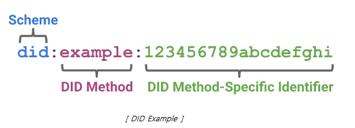

DID Creation
====================================

DID Creation is a function that allows a DID holder(did-client) to create a DID (Decentralized Identifier) by itself and generate an asymmetric key (private key/public key) for proof of ownership of the DID. Hereinafter, did-client is called holder.

DID is composed of the following text string, and DID is composed of three types: DID (URI) Scheme, DID method, and Method-specific identifier.

DID Scheme specifies what protocol URI (Uniform Resource Identifier) uses to access a resource. Since it follows the resource access method defined by did scheme, it is specified as did. The DID method shows which storage the DID document is stored in, and it is specified differently depending on the storage. (Example: Bitcoin is btcr, Ethereum is ethr, MITUM is mtm) Method-Specific Identifier indicates the location where the DID document is stored in the storage pointed to by the DID method. 

The generated DID is stored in the holder's DID wallet and is also included in the DID Document.

(Reference : W3C Decentralized Identifiers (DIDs) v1.0, W3C Candidate Recommendation Draft 29 May 2021 [https://www.w3.org/TR/did-core/])

A holder creates an asymmetric key together when creating a DID. The private key of the generated asymmetric key is stored in the holder's wallet, the public key is stored in the wallet, and the public key is stored in the DID document and stored in the blockchain.