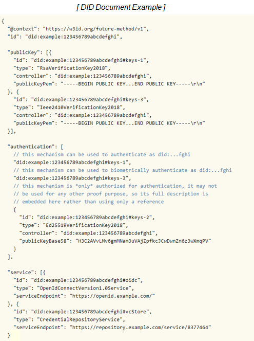
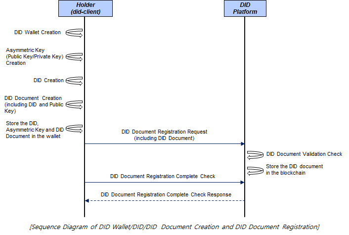

DID Document Creation
====================================

DID Document Creation and Registration is a function that allows DID holder(did-client) to create DID Documents, including authentication means to prove DID and DID ownership, and register them in the blockchain. Hereinafter, did-client is called holder.

DID Document Elements
====================================
 
DID Document includes items like the example below.

- @context : Defines the meaning of data such as id, publicKey, service, and controller in the DID document and what kind of data should be entered. @context is defined according to JSON-LD (JavaScript Object Notation for Linked Data) grammar.
- id : Specifies the holder's DID.
- publicKey: A list of public keys related to DID is specified. For DID ownership authentication, data that can use RSA (asymmetric key) and biometric authentication methods are included. The id is the authentication key that can be used in the public key, the type is the authentication method (RSA, etc.), the controller is the owner of the authentication authority for the publicKeyPem, and the publicKeyPem is the RSA (asymmetric key) authentication method, the public key is stored.
- authentication: Information to prove ownership of the DID is specified. Indicates which method of DID ownership from the list listed in publicKey is to be authenticated.
- service: Indicates a list of serviceEndpoints that can interact with the corresponding DID. (optional)

(Reference : W3C Decentralized Identifiers (DIDs) v1.0, W3C Candidate Recommendation Draft 29 May 2021 [https://www.w3.org/TR/did-core/])

DID Document Creation and Registration Procedure
====================================
The generated DID Document is stored in the holder's wallet.

In addition, the holder requests the DID document registration on the blockchain through DID platform, and sends a check message to the DID platform to confirm whether the DID document registration in the block chain is completed. (1 time)

The figure below is the overall sequence diagram for DID Wallet, DID and DID Document creation and DID Document registration.

